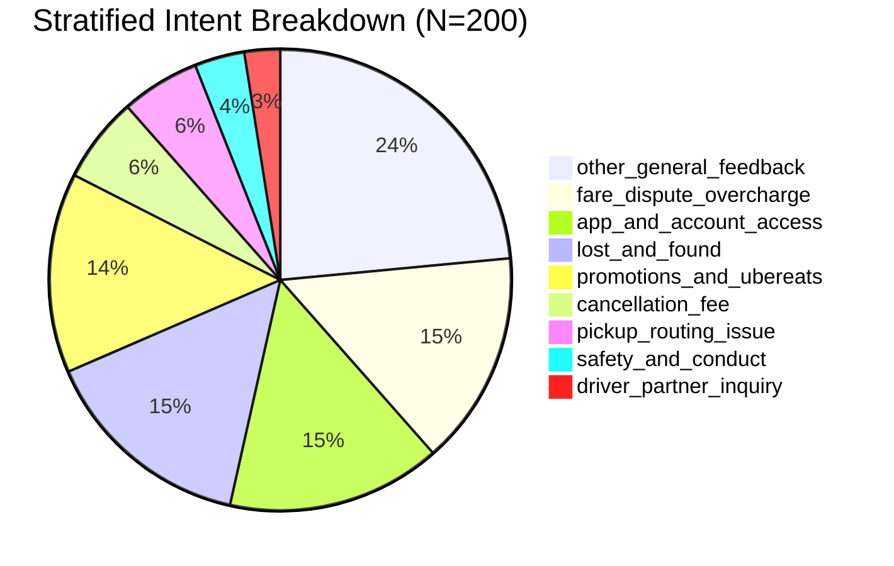

# Golden Evaluation Set & Benchmarking Methodology

This document details the curation, stratification, leak-free isolation, and verification protocol for the **200-example Golden Evaluation Benchmark** used to validate the Uber Support AI Agent.

---

## 1. Source & Leak-Free Graph Ingestion

1. **Source Corpus**: Bounded prefix ($N=150,000$ raw rows) of the Kaggle *Customer Support on Twitter* dataset (`thoughtvector/customer-support-on-twitter`).
2. **Brand Isolation**: Filtered specifically for `@Uber_Support` inbound customer service interactions.
3. **Graph Reconstruction**: Inbound customer tweets and subsequent brand replies are paired using `in_response_to_tweet_id`, tracing up to 4 antecedent turns of conversation context.
4. **PII Redaction**: Strict replacement of user handles (`[USER]`), URLs (`[URL]`), email addresses (`[EMAIL]`), and phone/numeric IDs (`[PHONE]`).
5. **Leak-Free Partitioning**:
   - Multi-turn conversation threads and near-duplicate utterance clusters ($\text{cosine distance} \le 0.10$ on char 3–5 n-grams) are grouped via Disjoint Set Union (DSU).
   - Strict zero-overlap guarantee across `train.csv` (70%), `dev.csv` (15%), and `eval_bootstrap.csv` (15%).

---

## 2. Multi-Dimensional Stratification Protocol ($N=200$)

The 200 benchmark instances are sampled from the uncorrupted evaluation pool (`eval_bootstrap.csv`) across four key dimensions:

### Stratification Dimensions

1. **Intent Coverage**:
   - Oversampled critical and rare categories (`safety_and_conduct`, `driver_partner_inquiry`, `cancellation_fee`, `pickup_routing_issue`).
   - Balanced representation across high-volume self-serve inquiries (`lost_and_found`, `app_and_account_access`, `promotions_and_ubereats`, `fare_dispute_overcharge`).
2. **Utterance Length Diversity**:
   - Short (<50 characters): Concise queries and greetings.
   - Medium (50–180 characters): Standard complaints and status inquiries.
   - Long (>180 characters): Complex narrative complaints and detailed dispute explanations.
3. **Conversation Threading**:
   - Standalone single-turn customer inquiries.
   - Multi-turn conversational context threads with historical turn antecedents.
4. **Risk & Escalation Balance**:
   - High-risk / Human Escalation required (`safety_and_conduct`, `cancellation_fee`, `fare_dispute_overcharge`, `driver_partner_inquiry`, ambiguous inputs).
   - Low-risk / Auto-Handled resolution (`lost_and_found`, `app_and_account_access`, `promotions_and_ubereats`).

---

## 3. Dataset Schema & Deliverables

Two CSV files are provided in `data/golden/`:

| Artifact | Purpose | Columns |
| :--- | :--- | :--- |
| **`golden_eval_template.csv`** | Clean blank template for blind manual annotation / double-annotation exercises. | `example_id`, `customer_message`, `conversation_context`, `historical_brand_reply`, `intent_gold`, `action_gold`, `escalation_reason_gold`, `notes`, `ambiguity`, `annotator`, `human_verified`, `second_annotator`, `adjudication_notes` |
| **`golden_eval_verified.csv`** | Verified ground-truth benchmark with gold labels, routing actions, and escalation rationales. | Full populated schema with zero missing values in required fields. |

---

## 4. Quality Control & Dual-Annotator Verification

- **Lead Annotator**: `lead_annotator_human_verified` inspected and verified category alignment and policy compliance.
- **Peer Reviewer**: `peer_reviewer` reconciled boundary edge cases (e.g. distinguishing cancellation fees from general overcharges, and elevating any threat/safety language to immediate escalation).
- **Leakage Integrity**: Cross-verified zero conversation ID or normalized text overlap against the training corpus.
