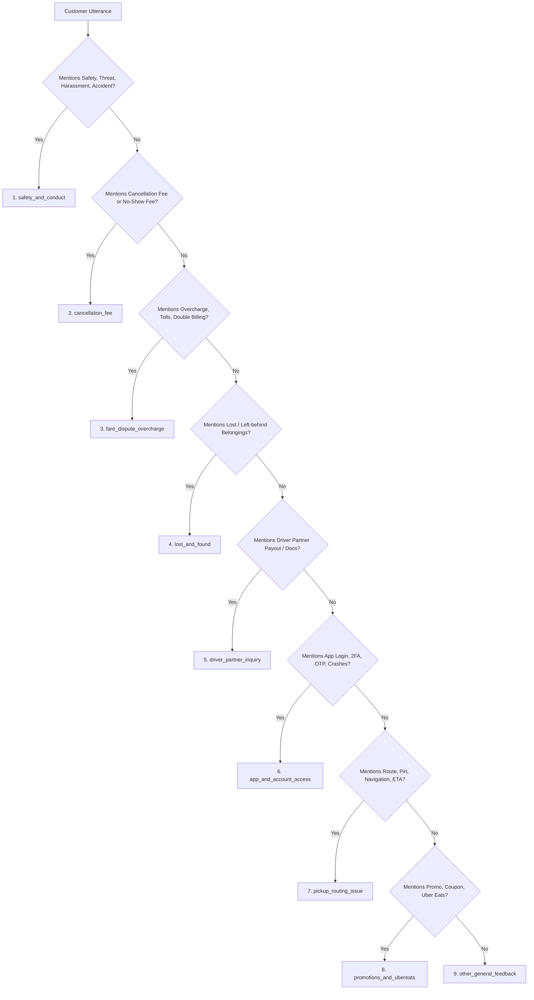

# Uber Support 9-Intent Domain Taxonomy

This taxonomy was derived from empirical analysis of customer support interactions for `@Uber_Support` in the Kaggle Customer Support on Twitter dataset. It structures the customer problem space into 9 mutually exclusive primary categories with explicit disambiguation hierarchies and escalation safety policies.

---

## 1. Intent Definitions & Routing Matrix

| Intent Key | Intent Name | Description | Example Utterance | Risk Level | Default Routing Policy |
| :--- | :--- | :--- | :--- | :--- | :--- |
| **`safety_and_conduct`** | Safety & Driver Conduct | Physical safety, reckless driving, verbal abuse, harassment, assault, accidents, intoxication, and emergencies. | *"Driver was speeding, ran a red light, and yelled at me."* | 🔴 High | **Immediate ESCALATE** (Safety Ops) |
| **`cancellation_fee`** | Cancellation Fee Dispute | Disputes over cancellation charges, driver no-shows, driver-initiated cancellations. | *"Driver cancelled after 10 minutes and I was charged a $5 fee."* | 🔴 High | **ESCALATE** (Financial / Trip Review) |
| **`fare_dispute_overcharge`** | Fare Dispute & Overcharge | Unexpected tolls, wrong route charges, upfront pricing discrepancies, double billing, unexpected surge pricing. | *"I was quoted $18 upfront but charged $45 on my card."* | 🔴 High | **ESCALATE** (Fare Adjustment / Refund) |
| **`lost_and_found`** | Lost and Found | Belongings left behind in vehicles (phones, wallets, keys, bags, sunglasses). | *"I forgot my backpack and wallet in the back seat."* | 🟢 Low | **AUTO_HANDLE** (Self-serve Driver Contact Workflow) |
| **`pickup_routing_issue`** | Pickup & Routing Issue | Driver arriving at incorrect pin, navigation errors, refusal to pick up, ETA delays, GPS glitches. | *"Driver went to the wrong terminal at JFK and drove away."* | 🟡 Medium | **CONDITIONAL_AUTO_HANDLE** / Escalate |
| **`app_and_account_access`** | App & Account Access | Login errors, 2FA/OTP failures, password resets, locked accounts, app crashes, updating phone number/email. | *"App crashes whenever I open the payment settings page."* | 🟡 Medium | **CONDITIONAL_AUTO_HANDLE** (Troubleshooting Steps) |
| **`promotions_and_ubereats`** | Promotions & Uber Eats | Promo codes not applying, Uber Cash issues, Uber Eats meal delivery delays, missing items. | *"My 20% discount coupon was not applied to my ride yesterday."* | 🟡 Medium | **CONDITIONAL_AUTO_HANDLE** / Escalate |
| **`driver_partner_inquiry`** | Driver Partner Inquiry | Driver partner questions: weekly payouts, earnings, background checks, document uploads, vehicle inspection. | *"When will my direct deposit payout for last week clear?"* | 🔴 High | **ESCALATE** (Driver Partner Operations) |
| **`other_general_feedback`** | Other / General Feedback | Compliments, broad feedback, non-actionable chatter, general greetings, spam. | *"Thanks to Uber for getting me home safely during the storm!"* | 🟢 Low | **AUTO_HANDLE** / Standard Acknowledgment |

---

## 2. Precedence Hierarchy & Boundary Disambiguation Rules

When an utterance contains multiple keywords or touches across multiple categories, apply the following deterministic precedence hierarchy:

### Boundary Case Analysis

1. **Safety vs. Fare Dispute**:
   * *Utterance:* "The driver was yelling threats at me and took the long route to overcharge me."
   * *Resolution:* `safety_and_conduct`. Safety incidents supersede financial adjustments.

2. **Cancellation Fee vs. Fare Dispute**:
   * *Utterance:* "I was overcharged because the driver didn't show up and I got hit with a cancellation fee."
   * *Resolution:* `cancellation_fee`. Specific cancellation penalty disputes take precedence over general fare overcharges.

3. **Lost Items with Complaints**:
   * *Utterance:* "I left my jacket in the car and the driver refused to answer my call."
   * *Resolution:* `lost_and_found`. The actionable primary driver is item recovery, unless explicit threats or abuse occurred.

4. **Driver Inquiries vs. Passenger Inquiries**:
   * *Utterance:* "My driver app is not showing my weekly fare breakdown."
   * *Resolution:* `driver_partner_inquiry`. Partner operations have dedicated financial channels and cannot be handled via passenger dispute flows.

---

## 3. High-Risk Escalation Policy

Any interaction mapped to `HIGH_RISK_INTENTS` (`safety_and_conduct`, `cancellation_fee`, `fare_dispute_overcharge`, `driver_partner_inquiry`) must trigger an automatic escalation recommendation regardless of classifier confidence score to preserve safety and financial compliance.
